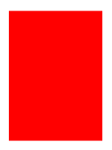

# E01: Simplest Shader

There are several different kinds of OpenGL shaders, but in Cocos2D you'll only need to deal with two, vertex shaders and fragment shaders. The most interesting kind are fragment shaders or "pixel shaders"[^1]. They are also the most intuitive. It's just a tiny little program that the GPU runs once for each pixel that a sprite covers on the screen. Every `CCShader` needs both a vertex shader and a fragment shader. Cocos2D has a default vertex shader built in, so you usually don't need to write one.

[^1]: What's a fragment? A fragment is best thought of as a partial pixel in OpenGL. The final pixel that is shown on the screen might be several fragments blended together. When doing 3D rendering a fragment might be covered up by another fragment rendered later, or a fragment might get thown away because it's behind the current fragment already shown.

## Loading Shaders:

Before we talk about how to write shaders, you need to know how to load them. Cocos2D 3.1 has made this *much* easier to do and everything in this cookbook assumes that you are using version 3.1 or newer. The following snippet shows how you would load and apply a shader to a sprite.

<pre style="text-align:left;color:#000000; background-color:#ffffff; border:solid black 1px; padding:0.5em 1em 0.5em 1em; overflow:auto;font-size:small; font-family:monospace; ">CCShader *monsterShader = [CCShader shaderNamed:@&quot;MonsterShader&quot;];
sprite.shader = monsterShader;
</pre>
This would look for a file named `MonsterShader.fsh` with your fragment shader code in it. You can also provide `MonsterShader.vsh` if you don't want Cocos2D to use it's default vertex shader. These two shaders get compiled together into a `CCShader` object.

## Dive In:

Enough talk. What does a shader actually look like? This is the simplest shader I could think of and it draws a sprite as pure red.

<pre style="text-align:left;color:#000000; background-color:#ffffff; border:solid black 1px; padding:0.5em 1em 0.5em 1em; overflow:auto;font-size:small; font-family:monospace; ">void main(){
</em>  gl_FragColor = vec4(1.0, 0.0, 0.0, 1.0);
}
</pre>

Shaders for Cocos2D are written in the GLSL language provided by OpenGL. Since it's meant to look a lot like C, it should already look somewhat familiar.

Every GLSL fragment shader needs two things:

* Like a C or Objective-C program, it needs to have a `main()` function that is called each time the shader is run.
 * It needs to assign a color  to the builtin `gl_FragColor` variable.

OpenGL uses _vectors_ to store colors and positions. So to output a color, you just need to make a 4 component vector for the red, green, blue and alpha chanels. You can initialize colors in GLSL in several ways:

<pre style="text-align:left;color:#000000; background-color:#ffffff; border:solid black 1px; padding:0.5em 1em 0.5em 1em; overflow:auto;font-size:small; font-family:monospace; "><em>// You can create a vector using the vec4 constructor:
</em>gl_FragColor = vec4(redValue, greenValue, blueValue, alphaValue);

<em>// You can set color components individually:
</em>gl_FragColor.r = redValue;
gl_FragColor.g = greenValue;
gl_FragColor.b = blueValue;
gl_FragColor.a = alphaValue;

<em>// Vectors can also be treated like arrays:
</em>gl_FragColor[0] = redValue;
gl_FragColor[1] = greenValue;
gl_FragColor[2] = blueValue;
gl_FragColor[3] = alphaValue;
</pre>

Lastly, GLSL uses floating point numbers between 0 and 1 for colors. Forget that you've ever heard the number 255 in relation to colors!

## What you should know now:

* How to load a shader.
* How to apply a shader to a sprite.
* The basic structure of a fragment shader.
* GLSL colors are stored in vectors.

## Exercises:

* Make the shader output blue.
* Make the shader output 50% gray.