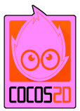

# E02: Sprite Color

Neat, so example 1 taught us how to use shaders to draw pure red sprites so you can make the next hit game with a minimalist style. This next example is actually the default Cocos2D shader and is responsible for most of the drawing you see in Cocos2D games.

<pre style="text-align:left;color:#000000; background-color:#ffffff; border:solid black 1px; padding:0.5em 1em 0.5em 1em; overflow:auto;font-size:small; font-family:monospace; ">void main(){
  <em>// Read the sprite's texture's color for the current pixel.
</em>  vec4 textureColor = texture2D(cc_MainTexture, cc_FragTexCoord1);
  
  <em>// Tint the texture color by the sprite's color.
</em>  gl_FragColor = cc_FragColor*textureColor;
}
</pre>

## Sampling Textures:

In order to draw a sprite, you need to figure out what texture pixel to draw for each screen pixel. When you think about rotating, scaling or skewing sprites this might sound complicated. Fortunately OpenGL and Cocos2D do most of the work for you!

Let's break down the first line:

* `texture2D()` is a builtin GLSL function that samples a texture at a certain location.
* `cc_MainTexture` is a builtin variable that Cocos2D provides for the current sprite being rendered.
* `cc_FragTexCoord1` is another builtin variable that Cocos2D provides. It's the texture coordinate you should read from in a fragment shader to correctly draw a sprite.

Putting that all together, `texture2D(cc_MainTexture, cc_FragTexCoord1)` reads a color from the sprite's texture for the current output pixel. That's not so bad.

## Color Math:

Sprites in Cocos2D have a tinting color. As the tint color gets darker, so does the sprite. As the color gets more red, the sprite gets more red. As the color gets more transparent, so does the sprite. Let's implement that.

First you need to know about another builtin Cocos2D variable `cc_FragColor`. For sprites, this is its _premultiplied_ color. Premultiplying a color just means that it's original red, green, and blue values have been multiplied by the alpha. This might sound like a dumb and random thing to do, but it solves a _lot_ of problems. Most every color value you will ever use in a shader will be premultiplied. The default alpha blending function in Cocos2D requires shaders to output premultiplied colors as well.

So, how do you ipmlement tinting in a shader? It's actually really easy. All you need to do is muliply the two colors together.

<pre style="text-align:left;color:#000000; background-color:#ffffff; border:solid black 1px; padding:0.5em 1em 0.5em 1em; overflow:auto;font-size:small; font-family:monospace; "><em>// You can do it the long way:
</em>gl_FragColor.r = cc_FragColor.r*textureColor.r;
gl_FragColor.g = cc_FragColor.g*textureColor.g;
gl_FragColor.b = cc_FragColor.b*textureColor.b;
gl_FragColor.a = cc_FragColor.a*textureColor.a;

<em>// Or use a vector multiply to do the same thing:
</em>gl_FragColor = cc_FragColor*textureColor;
</pre>

Because both `textureColor` and `cc_FragColor` were premultiplied, the result is premultiplied as well. Handy right?

"Vector math" might sound scary, but it doesn't have to. Just think of it as doing the same operation to each component like in the example above. The +, -, *, and / operators all work the same way.

## Exercises:

* Modify the shader to brighten the sprite by it's color instead.
