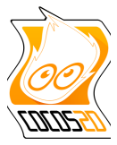

# E03: Sprite Distort

Example 2 showed you how to draw a textured sprite in a shader, but that's still really basic. Now let's try something more interesting that you can only do with a shader. What happens if we change the magically calculated texture coordinate before accessing the texture?

<pre style="text-align:left;color:#000000; background-color:#ffffff; border:solid black 1px; padding:0.5em 1em 0.5em 1em; overflow:auto;font-size:small; font-family:monospace; ">void main(){
  vec2 texCoord = cc_FragTexCoord1;
  
  float time = cc_Time[0];
  texCoord.x += 0.1*sin(10.0*texCoord.y + time);
  
  gl_FragColor = cc_FragColor*texture2D(cc_MainTexture, texCoord);
}
</pre>
Some new stuff here:

* Vector sizes. Up to this point we've only been using for component vectors for colors. You can make 2 and 3 component vectors as well. `cc_FragTexCoord1` is an x/y coordinate, so we need to store it in a vec2 variable.
* New Cocos2D builtin variable `cc_Time`. This is a 4 component vector that stores varous time related values. The first element is regular time.
* Yet another way to access vectors. You can use xyzw in addition to rgba or array notation. (Also stpq... but forget I mentioned it)
* More builtin GLSL functions.[^1] In this case `sin()`.

So now instead of reading the texture coordinates directly as Cocos2D calculated them, use some animated sine waves to distort the texture. It's important to keep in mind that a fragment shader can't change what pixels a sprite will draw _into_. It can only change what pixels it draws _from_. I intentionally made the sine wave cause the sprite to clip against it's left and right edges to show this.

## Texture Coordinates:

It's important to know that texture coordinates are normalized and __not in pixels__. This means that (0, 0) is the lowel left of a texture and (1, 1) is the upper right. If you want to apply distortions to a sprite's texture, you need to keep in mind the size and aspect ratio of the texture.

The reason why OpenGL works this way is so that it's easy to substitute a higher resolution texture without needing to recalculate texture coordinates. It doesn't always make it easy to do special effects shaders though.

## Exercises:

* Experiment with more ways to distort the texture. See if you can make any fun effects.

[^1]: For a nice GLSL summary, [here](http://www.khronos.org/opengles/sdk/docs/reference_cards/OpenGL-ES-2_0-Reference-card.pdf) is a handy GLSL ES Cheat Sheet. I would highly recommend saving it somewhere convenient.