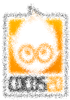

#E11: Diffusion

This is one of my favorite effects. It uses a noise texture to offset each pixel slightly. This produces a nice little noisy blur effect. Since it only requires a single dependent texture lookup per pixel, it's pretty cheap as a blur.

The vertex shader should look quite familiar already.

<pre style="text-align:left;color:#000000; background-color:#ffffff; border:solid black 1px; padding:0.5em 1em 0.5em 1em; overflow:auto;font-size:small; font-family:monospace; ">uniform vec2 u_NoiseTextureSize;

uniform float u_AnimationEnabled;
uniform float u_BlockSize;

void main(){
  gl_Position = cc_Position;
  cc_FragColor = clamp(cc_Color, 0.0, 1.0);
  cc_FragTexCoord1 = cc_TexCoord1;
  
  vec2 screen01 = (0.5*gl_Position.xy/gl_Position.w + 0.5);
  cc_FragTexCoord2 = screen01*cc_ViewSizeInPixels/u_NoiseTextureSize;
  vec2 randomAnimatedOffset = cc_Random01.xy*u_AnimationEnabled;
  cc_FragTexCoord2 = (uv + randomAnimatedOffset)/u_BlockSize;
}
</pre>

The fragment shader is also unsurprising.

<pre style="text-align:left;color:#000000; background-color:#ffffff; border:solid black 1px; padding:0.5em 1em 0.5em 1em; overflow:auto;font-size:small; font-family:monospace; ">uniform float u_Radius;
uniform vec2 u_MainTextureSize;
uniform sampler2D u_NoiseTexture;

void main(){
  vec2 noise = 2.0*texture2D(u_NoiseTexture, cc_FragTexCoord2).xy - 1.0;
  vec2 distortionOffset = u_BlurRadius*noise/u_MainTextureSize;
  
  gl_FragColor = cc_FragColor*texture2D(cc_MainTexture, cc_FragTexCoord1 + distortionOffset);
}
</pre>

One important thing to note here is that the noise texture I used has a gausian distribution. This means that the color values are more likely to be gray than white or black. If it had a uniform distribution, meaning it's just as likely to be white, gray or black, then the blur wouldn't look as good.

## Exercises:

* Try different noise textures. See how it changes the result.