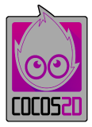

E12: Color Matrix

Have you ever wanted to have color adjustments in Cocos2D like you do in PhotoShop? Some way to adjust the hue, saturation, brightness, contrast, or exposure of a sprite on the fly?

Well it turns out that it's really quite simple to do with a shader:

<pre style="text-align:left;color:#000000; background-color:#ffffff; border:solid black 1px; padding:0.5em 1em 0.5em 1em; overflow:auto;font-size:small; font-family:monospace; ">uniform mat4 u_ColorMatrix;

void main(){
  gl_FragColor = u_ColorMatrix*texture2D(cc_MainTexture, cc_FragTexCoord1);
}
</pre>

You can use transformation matrices to rotate or scale sprites. Since colors are just vectors, it makes just as much sense to use matrices on colors. The catch is of course finding the right matrix to apply. There are some [good examples](http://www.graficaobscura.com/matrix/) online.

Take a look at the Objective-C code for this example to see how the matrices are made.

# Exercises:

* See if you can find any more interesting color matrices.